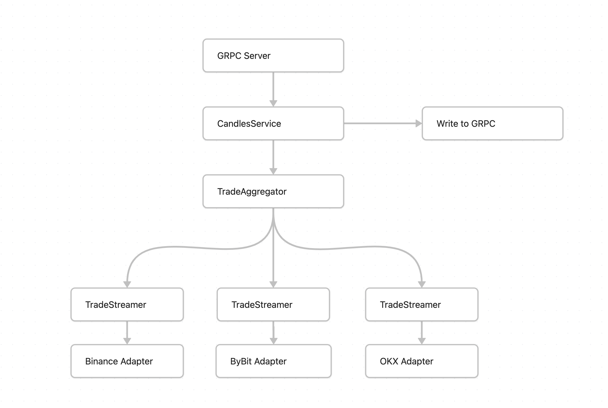

# Hermeneutic Candles

GRPC Candles service for Hermeneutic Investments. Aggregates information from 3 CEXs (Binance, ByBit, OKX)

## Server

The server runs on `localhost:8080`

### Flags

| Name     | Flag         | Mandatory | Description                                       |
| -------- | ------------ | --------- | ------------------------------------------------- |
| interval | `--interval` | NO        | interval between candle responses in milliseconds |


### Running Locally

```sh
go run ./cmd/server/main.go --interval=5000
```

### Running on docker-compose

The flags are accepted as environment variables when running on `docker-compose`

```sh
INTERVAL=10000 docker compose up candles-server -d
```

## API

### Endpoints

#### proto.candles.v1.CandlesService/StreamCandles

Streams candles given a list of symbols. Aggregates data from 3 CEXs (Binance, ByBit, OKX)

##### Request fields:

| Name    | Type     | Mandatory | Description               |
| ------- | -------- | --------- | ------------------------- |
| symbols | string[] | YES       | List of symbols to stream |


```json
{
    "symbols": ["btc-usdt", "eth-usdt"]
}
```

### cURL example

```sh
grpcurl \
    -protoset <(buf build -o -) -plaintext \
    -d '{"symbols": ["btc-usdt", "eth-usdt"]}' \
    localhost:8080 proto.candles.v1.CandlesService/StreamCandles
```

## Client

A simple GRPC client that uses `connect-go` to connect to the server

### Flags

| Name    | Flag        | Mandatory | Description                                                                                         |
| ------- | ----------- | --------- | --------------------------------------------------------------------------------------------------- |
| server  | `--server`  | NO        | Address of the candles server to connect to. Defaults to `http://localhost:8080`                    |
| symbols | `--symbols` | NO        | comma separated list of symbols. Each symbol must be pairs separated by `-`. Defaults to `btc-usdt` |

### Running locally

```sh
go run cmd/client/main.go --server="http://localhost:8080" --symbols=btc-usdt,eth-usdt
```

### Running on docker-compose

The flags are accepted as environment variables when running on `docker-compose`

```sh
SYMBOLS=btc-usdt,eth-usdt docker compose up candles-client -d
```

## Technical

- The service uses `connect-go` for its GRPC client and server
- The `adapter` pattern is implemented to easily add more exchanges
- The websocket connection automatically retries for 5 times (linear backoff) in case dialing the server fails. Can be improved as necessary
- There is a primitive backpressure handling by way of limiting the channel buffer size and setting the maximum number of trades per interval. This can be optimized in the future.

### Diagram



Each connection to the exchange runs in a goroutine, and forwards trade data into a channel. Another goroutine converts and forwards trade data from the channel to be written to the GRPC connection

## Caveats

- The input accepts the format `"%s-%s"`, but outputs `"%s%s"`. This is intentional for now for speed
    - The reason is because converting from `"%s-%s"` to `"%s%s"` is a destructive operation (no delimiter), and it is hard to convert the format back
    - Different exchanges accepts different formats, and also outputs different format
- The server runs in `h2c` mode, which is `HTTP/2` without TLS. If we are planning to expose the server publicly or add browser support, we must change it to `h2`.
- There are no implementations on reconnecting when the connection to the exchange terminates. The strategy is documented under TODO

## Maintainers

### Updating protobuf interface

1. Modify `proto/candles/v1/candles.proto`
2. Run `buf lint` to identify any problems
3. Run `buf generate` to generate the new go types

> Important: Do not update `gen/*`, which contains all the generated files from the `buf` library

### Adding new Exchanges

Adding a new exchange is simple

1. Create a new directory under `internal/exchange`, e.g. `internal/exchange/coinbase`
2. Create a new adapter that implements the `ExchangeAdapter` interface (`internal/exchange/interface.go`)
3. Register a new `TradeStreamer` in `CandlesService/StreamCandles` that accepts the new adapter that you created (`internal/candles/service.go`)
4. Append the new `TradeStreamer` to the `TradeAggregator` in `CandlesService/StreamCandles` (`internal/candles/service.go`)

## TODO
- [x] Query data from 3 CEXs
- [x] Accept command line input for interval
- [x] Resiliency:
    - [x] network interruption from CEX
    - [x] Recover if client disconnects
- [x] docker compose
- [x] accept symbols from GRPC request
- [x] Handle backpressure (too many messages coming in)
- [x] Client
- [ ] Recover using candlestick data from REST endpoint
- [ ] Tests
- [ ] Handle differences in symbol encoding between request and response (btc-usdt vs btcusdt)
- [ ] Handle disconnection after successful subscription
    - Subscribe to the heartbeat API of the exchange
    - If there is no heartbeat stream, the manually `ping` the exchange server at an interval
    - Reconnect gracefully if there is no `pong` after a certain duration
